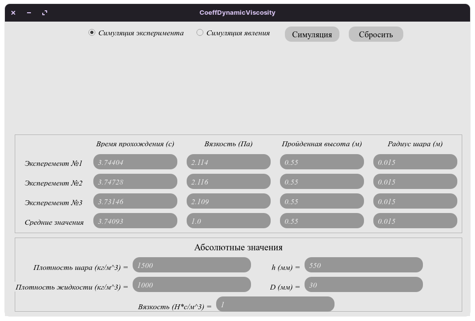
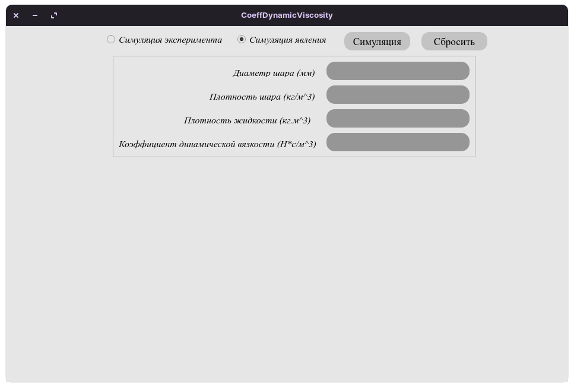
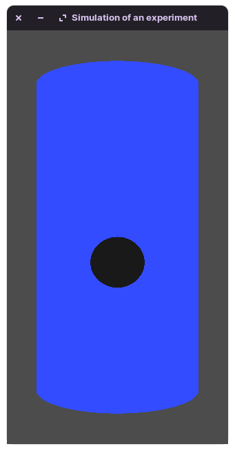
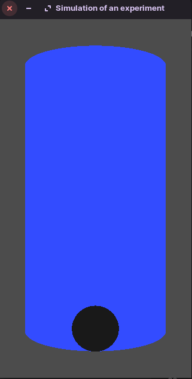

# Определение коэффициента динамической вязкости жидкости по методу Стокса

***Данное приложение направлено на симуляцию эксперемента по определению коэффициента динамической вязкости жидкости по методу Стокса, а также его проведение и вычисление значений.***

## ***Запуск***

### *Для Windows:*
- Все просто, просто запустите CoeffDynamicViscosity.py

### *Для Linux (Ubuntu, Mint, Zorin OS и т.д.):*
- Запустите скрипт  ```CoeffDynamicViscosity.sh```
- Потребует пароль root, введите его (скрипт установит недостающие компоненты самостоятельно)
- **Если не запускается как исполняемый файл**
    - В папке со скриптом введите команду
    ```bash
    sudo chmod 775 CoeffDynamicViscosity.sh
    ```
    - Запросит root пароль, введите его

### *Для Linux (С помощью Python):*
- Обновите пакет python3.8 или установите
- Установите пакет ```python3-venv```, ```python3-pip```, а также ```freeglut3-dev```
- Создайте окружение и установите зависимости
```bash
python3 -m venv venv
source /venv/bin/activate
pip3 install wheel
pip3 install -r requirements.txt
```
- Запустите приложение
```bash
python3 CoeffDynamicViscosity.py
```
- **Создание ярлыка**
    - Создайте в любом месте файл ```CoeffDynamicViscosity.desktop```
    - Запишите в него
```bash
[Desktop Entry]
Name=CoeffDynamicViscosity
Comment=Программа для определения коэффициента вязкости методом Стокса
Exec=python3 <путь до .py файла>
Terminal=false
Type=Application
Icon=<полный путь до [папка с приложением]/bin/icos/app_ico.ico>
Path=<путь до папки с приложением>
Categories=System
```

### *Для Windows (С помощью Python):*
- Установите [Python версии 3.8.5] (https://www.python.org/ftp/python/3.8.5/python-3.8.5-webinstall.exe)
- В папке с приложением запустите терминал:
```bash
python -m venv venv
.\venv\Scripts\activate
pip install -r requirements_win.txt
pip install .\bin\whl\PyOpenGL-3.1.6-cp38-cp38-win32.whl
pip install .\bin\whl\PyOpenGL_accelerate-3.1.6-cp38-cp38-win32.whl
```
- Для запуска приложения нужно из папки приложения в терминале ввести
```bash
.\venv\Scripts\activate
python CoeffDynamicViscosity.py
```


## ***Скриншоты***
*Проведение эксперимента (до вычислений):*


*Проведение эксперимента (после вычислений):*


*Симуляция явления:*


*Окно с симуляцией:*

